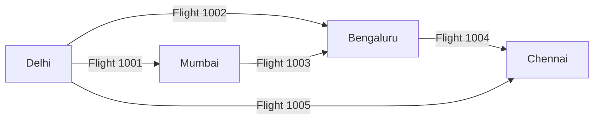
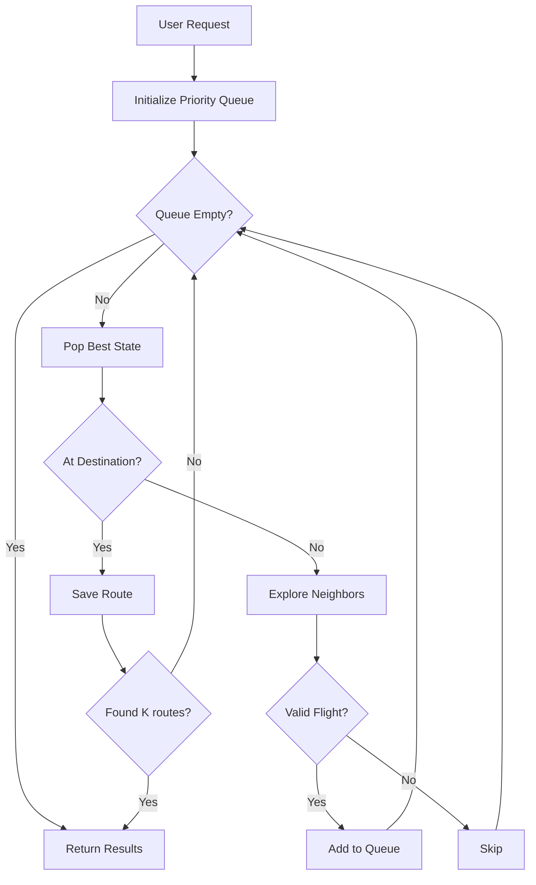

# Smart Routes Algorithm Documentation
## Finding the K-Best Flight Routes

---

## 🎯 What Does This Algorithm Do?

The `find_smart_routes` function solves a **real-world travel problem**: Given a starting airport, a destination airport, and a travel date, find the **K best (shortest)** flight routes — including direct flights and connecting flights.

Think of it like asking Google Flights: *"Show me the top 5 ways to get from Delhi to Mumbai on December 10th."*

---

## 🧠 The Core Idea: Yen's K-Shortest Paths Algorithm

This algorithm is based on **Yen's K-Shortest Paths Algorithm**, a well-known method to find not just ONE best path, but the **top K best paths** in a graph.

### Why Not Just Dijkstra?
- **Dijkstra's Algorithm** finds only the single shortest path
- **Yen's Algorithm** extends this concept to find multiple alternatives
- This is essential for flight booking where users want **options**, not just one answer

---

## 🗺️ The Flight Network as a Graph

Before understanding the algorithm, visualize the data structure:



**Key Concepts:**
| Real World | Graph Term |
|------------|------------|
| Airport | Node/Vertex |
| Flight | Edge |
| Flight Duration | Edge Weight |
| Finding Best Route | Shortest Path Problem |

---

## 🔄 Step-by-Step Flow of the Algorithm

### Step 1: Initialize the Search

```
┌─────────────────────────────────────────────────────────┐
│  START: User wants to fly from DEL → BOM on 2025-12-10 │
└─────────────────────────────────────────────────────────┘
                           │
                           ▼
              ┌────────────────────────┐
              │  Create Priority Queue │
              │  (Min-Heap by time)    │
              └────────────────────────┘
                           │
                           ▼
              ┌────────────────────────┐
              │  Push starting state:  │
              │  • Position: DEL       │
              │  • Time spent: 0 mins  │
              │  • Path history: empty │
              └────────────────────────┘
```

**The Priority Queue** ensures we always explore the path with the **least total time** first. This is the "greedy" aspect of the algorithm.

---

### Step 2: The Exploration Loop

```
┌─────────────────────────────────────────────────────────────────┐
│                     MAIN LOOP                                   │
│  "Keep exploring until we find K routes or run out of options" │
└─────────────────────────────────────────────────────────────────┘
                              │
                              ▼
                 ┌────────────────────────┐
                 │  Pop the best state    │
                 │  (lowest time so far)  │
                 └────────────────────────┘
                              │
              ┌───────────────┴───────────────┐
              │                               │
              ▼                               ▼
    ┌─────────────────┐             ┌─────────────────┐
    │ Is this the     │             │ Not destination │
    │ DESTINATION?    │             │ yet, keep going │
    └─────────────────┘             └─────────────────┘
              │                               │
              ▼                               ▼
    ┌─────────────────┐             ┌─────────────────┐
    │ ✅ FOUND A ROUTE│             │ Explore all     │
    │ Save it!        │             │ outgoing flights│
    └─────────────────┘             └─────────────────┘
```

---

### Step 3: Validating Each Flight (Smart Filtering)

When exploring outgoing flights from any airport, the algorithm applies **smart filters**:

```
┌─────────────────────────────────────────────────────────────┐
│               FLIGHT VALIDATION CHECKS                       │
└─────────────────────────────────────────────────────────────┘
                              │
        ┌─────────────────────┼─────────────────────┐
        │                     │                     │
        ▼                     ▼                     ▼
┌───────────────┐    ┌───────────────┐    ┌───────────────┐
│ DATE CHECK    │    │ CYCLE CHECK   │    │ TIME CHECK    │
│               │    │               │    │               │
│ Is this flight│    │ Have we       │    │ Does this     │
│ on the right  │    │ already been  │    │ flight depart │
│ travel date?  │    │ to this       │    │ AFTER we      │
│               │    │ airport?      │    │ arrive?       │
└───────────────┘    └───────────────┘    └───────────────┘
        │                     │                     │
        ▼                     ▼                     ▼
   ❌ Skip if               ❌ Skip if            ❌ Skip if
   wrong date             creates loop          impossible
                                                 connection
```

**Example of Time Check:**
- You land in Bengaluru at 14:00
- A connecting flight departs at 13:30
- ❌ This is **impossible** — you can't catch a flight that already left!

---

### Step 4: Building & Tracking Path History

```
┌───────────────────────────────────────────────────────────────────┐
│                      PATH HISTORY TRACKING                         │
└───────────────────────────────────────────────────────────────────┘

Each "state" in the queue carries its complete journey history:

State at BLR = {
    total_time: 150 minutes,
    current_position: "BLR",
    history: [
        Flight DEL→BOM (90 mins),
        Flight BOM→BLR (60 mins)
    ]
}

When we move to the next airport, we:
1. Copy the current history
2. Add the new flight
3. Add layover time (60 mins buffer for connections)
```

---

### Step 5: Route Found — Build the Result

When we reach the destination:

```
┌─────────────────────────────────────────────────────────────────┐
│                     DESTINATION REACHED!                         │
│                    Build the route result                        │
└─────────────────────────────────────────────────────────────────┘
                              │
                              ▼
┌─────────────────────────────────────────────────────────────────┐
│  Route Output Contains:                                          │
│                                                                  │
│  • total_time: 210 minutes                                       │
│  • duration_fmt: "3h 30m"                                        │
│  • stops: 1 (number of connections)                              │
│  • total_price: ₹8,500                                           │
│  • segments: [                                                   │
│      { DEL → BOM, 09:00-11:00, ₹4,500, IndiGo }                 │
│      { BOM → MAA, 12:00-14:30, ₹4,000, Vistara }                │
│    ]                                                             │
└─────────────────────────────────────────────────────────────────┘
```

---

## 🔑 Key Optimization: Visit Limiting

```
┌─────────────────────────────────────────────────────────────────┐
│                    VISIT COUNTER                                 │
│        "Don't explore the same airport too many times"          │
└─────────────────────────────────────────────────────────────────┘

visits["DEL"] = 0  →  First time at Delhi
visits["BOM"] = 1  →  Already visited Mumbai once
visits["BOM"] = 2  →  Visited Mumbai twice

IF visits[airport] >= K:
    SKIP this state (we've explored enough alternatives)

This prevents the algorithm from running forever on complex graphs!
```

---

## 📊 Visual Example: Finding 3 Routes from DEL to MAA

```
┌─────────────────────────────────────────────────────────────────┐
│  INPUT: Source=DEL, Destination=MAA, Date=2025-12-10, K=3      │
└─────────────────────────────────────────────────────────────────┘

Round 1: Pop DEL (0 mins)
    → Explore: DEL→BOM, DEL→BLR, DEL→MAA (direct!)
    → Push all valid flights to queue

Round 2: Pop DEL→MAA direct (120 mins) ← Shortest!
    → We're at MAA! 🎉 Save as Route #1

Round 3: Pop DEL→BLR (90 mins)
    → Explore: BLR→MAA, BLR→HYD, etc.
    → Push valid connections

Round 4: Pop DEL→BOM (100 mins)  
    → Explore: BOM→MAA, BOM→BLR, etc.

Round 5: Pop DEL→BLR→MAA (180 mins)
    → We're at MAA! 🎉 Save as Route #2

Round 6: Pop DEL→BOM→MAA (210 mins)
    → We're at MAA! 🎉 Save as Route #3

┌─────────────────────────────────────────────────────────────────┐
│  OUTPUT: 3 Routes Found!                                         │
│                                                                  │
│  Route 1: DEL → MAA (Direct) - 2h 00m - ₹5,500                  │
│  Route 2: DEL → BLR → MAA    - 3h 00m - ₹4,200                  │
│  Route 3: DEL → BOM → MAA    - 3h 30m - ₹3,800                  │
└─────────────────────────────────────────────────────────────────┘
```

---

## 🧩 How It All Connects



---

## 💡 Why This Approach Works Well for Flight Search

| Challenge | Solution in Algorithm |
|-----------|----------------------|
| Find multiple options | K-shortest paths, not just one |
| Handle connections | Track path history, validate times |
| Avoid loops | Cycle detection in history |
| Prioritize speed | Min-heap orders by total time |
| Real-world constraints | Date filtering, layover time buffer |

---

## 📚 Algorithm Reference

This implementation is based on:
- **Yen's Algorithm** for K-shortest paths
- **Dijkstra's Algorithm** (single-source shortest path)
- **Priority Queue (Min-Heap)** data structure

**Time Complexity:** O(K × N × (M + N log N))
- K = number of routes to find
- N = number of airports  
- M = number of flights

---

## 🎓 Summary

The Smart Routes algorithm:

1. **Models** the flight network as a weighted graph
2. **Uses** a priority queue to always explore the fastest option first
3. **Validates** each flight for date, timing, and no cycles
4. **Tracks** complete journey history for each possible path
5. **Collects** the first K valid routes that reach the destination
6. **Returns** detailed route information including segments, prices, and times

This gives users **multiple flight options** sorted by total travel time — exactly what modern flight search engines do!
